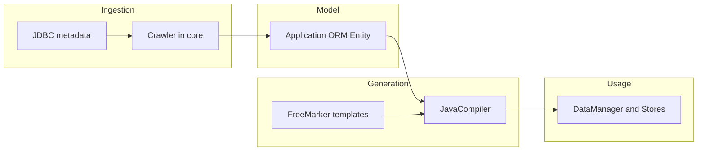

# SQL Components documentation

This folder describes the **sqlcomponents** multi-module Maven project: how it reads database metadata, maps it to a Java-friendly model, generates persistence-oriented Java sources, and how the **datastore** example module validates that story end-to-end.

The root [README.md](../README.md) (sqlbridge notes, Docker, Maven commands) stays the quick operational entry; use this `docs/` tree for **architecture and module behavior**.

---

## High-level picture

SQL Components is a **code generator** built around JDBC:

1. **Connect** to a live database using URL, credentials, and driver settings held in `Application`.
2. **Crawl** catalog metadata (tables, columns, keys, indexes, procedures, types, …) into relational POJOs in the **core** module.
3. **Map** columns and entities to Java types and ORM structures (today: **`JavaMapper`** in the **compiler** module).
4. **Generate** Java source files with **FreeMarker** templates—notably a façade **`DataManager`**, table-aligned **`…Store`** classes, and **`Record`** / enum-style types.
5. **Consume** the generated code from application or test code (the **datastore** module demonstrates this against PostgreSQL).

**Design intent** (aligned with the root README themes): catch schema issues early, support multiple dialects, and emit readable Java that wraps SQL construction and execution—without replacing the database at runtime.

---

## Core-level reading guide

Read in this order if you are onboarding to the codebase:

| Order | Document | What you learn |
|-------|----------|----------------|
| 1 | [Project structure](project-structure.md) | Directories, which Maven modules build from the root reactor, dependency direction, where templates and generated files live. |
| 2 | [Core module](core.md) | `Crawler`, relational model types, `Application`, `Compiler` SPI, YAML loading via `CoreConsts`. |
| 3 | [Compiler module](compiler.md) | `JavaCompiler` pipeline, `JavaMapper`, FreeMarker template layout, how tests configure output paths. |
| 4 | [Datastore module](datastore.md) | Example/integration tests, dependency on generated `org.example` code, building with `mvn -f datastore/pom.xml`. |

---

## Contributing and license

- **[CONTRIBUTING.md](../CONTRIBUTING.md)** — How to propose changes, run checks, and interact with maintainers.
- **[LICENSE](../LICENSE)** — Legal terms for using and redistributing the project.

---

## Related links

- Upstream context in POM: [https://github.com/sqlcomponents/sqlcomponents](https://github.com/sqlcomponents/sqlcomponents)
- Root [README.md](../README.md) — Docker Compose, `mvn` recipes, JDK notes.
